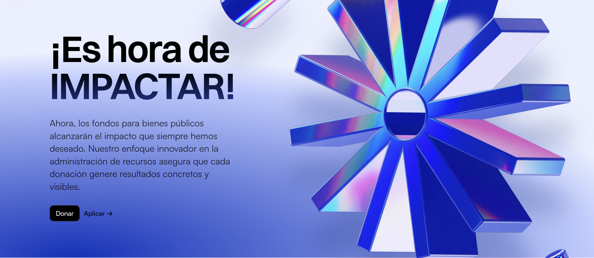
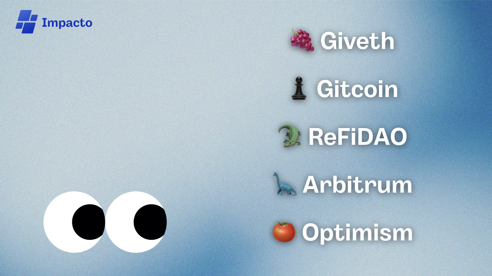

<h1 align="center">Impacto </h1>

Impacto es una plataforma que permite el financiamiento y apoyo a proyectos de bien público. <i>Somos la solución definitiva a Gitcoin</i>. Impacto brinda una forma más robusta de selección de los proyectos que son presentados ante un fórum, comunidad o DAO.

<h2>Problemas actuales en las gobernanzas</h2>

    <ol>
        <li>
            <b>Curación de los proyectos:</b> Muchas veces nos hemos topado con la problemática de que los proyectos que son subidos a las rondas de financiamiento, son proyectos sin objetivos bien planteados, mal documentados, sin beneficios reales para sus comunidades o simplemente no cumplen con los requerimientos básicos para subir una propuesta (presupuesto, propuesta escrita, targets, objetivos y más).
        </li> 
        <li>
            <b>Seguimiento del cumplimiento:</b> Otra problemática vital, sobre todo para los financiadores, es el seguimiento a las propuestas que fueron ganadoras y financiadas. Muchas veces, estas propuestas dejan de ser gestionadas por parte de los proponentes, lo que inspira desconfianza si el equipo realizó lo planteado por lo cual ganó financiamiento o no, ¡Es grave!
        </li> 
        <li>
            <b>Nivelación de las votaciones:</b> El peso de los votos durante las rondas de votación, en ocasiones no es justo, ya sea porque otra persona tiene más dinero y puede comprar más tokens para votar, o porque simplemente, cualquier persona tiene el mismo peso de voto, tu voto vale un punto ya sea que eres nuevo en la comunidad o council/miembro. ¡Se vuelve muy desequilibrado!
        </li>
    </ol>
    
<b>Algunas plataformas muy famosas que luchan contra estas problemáticas son:</b>

    

    <h2>
        La solución: Impacto 
    </h2>
    

        Evaluamos las problemáticas antes mencionadas.
    

