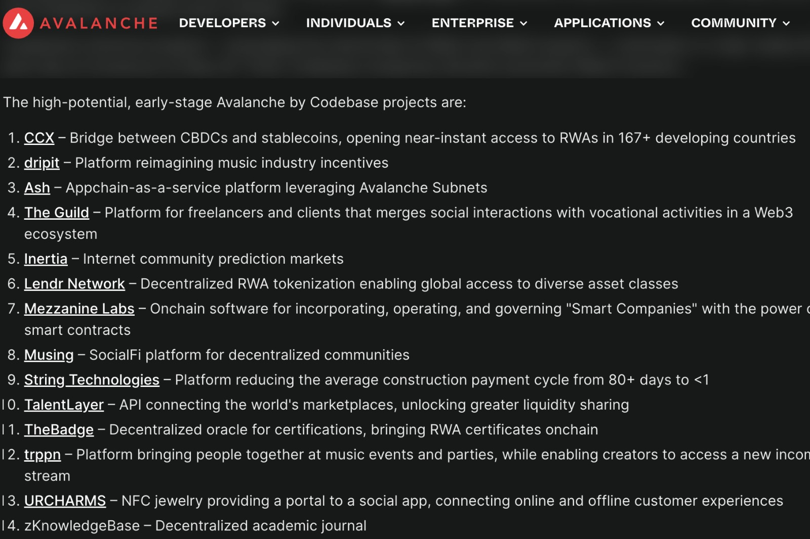
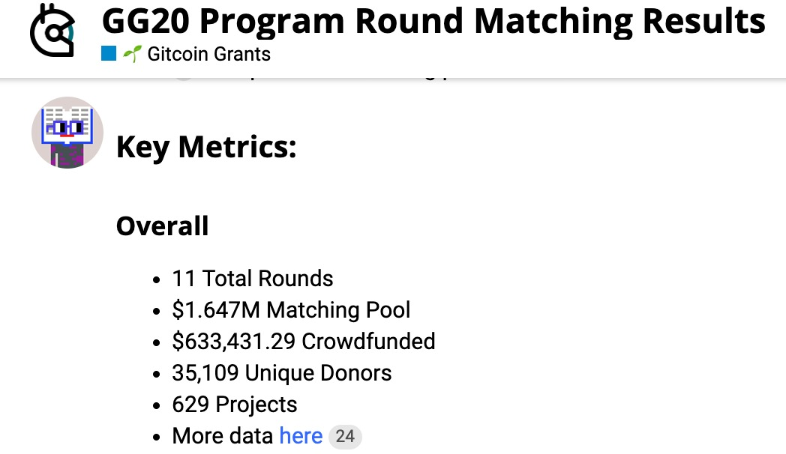
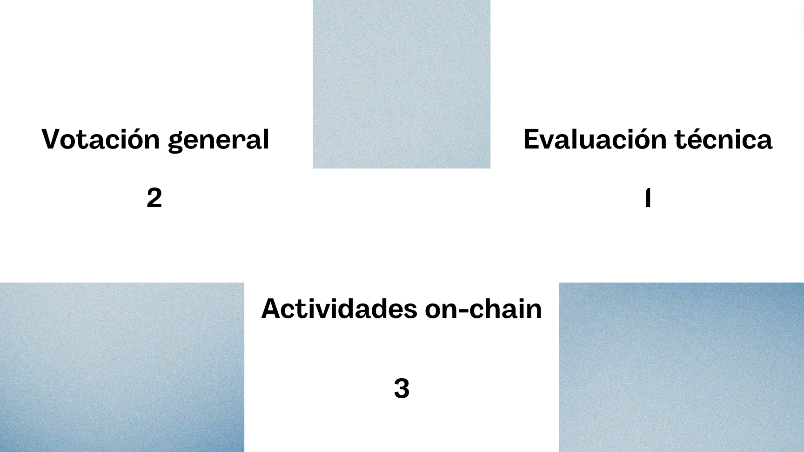
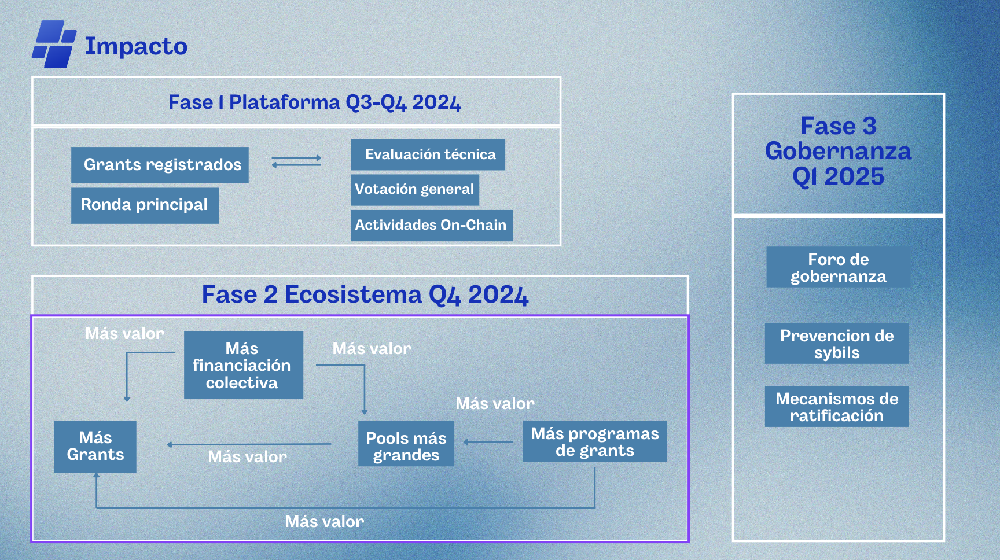

<h1 align="center">Impacto </h1>
<p>Impacto es una plataforma que permite el financiamiento y apoyo a proyectos de bien público. <i>Somos la solución definitiva a Gitcoin</i>. Impacto brinda una forma más robusta de selección de los proyectos que son presentados ante un fórum, comunidad o DAO.</p>

<h2>Problemas actuales en las gobernanzas</h2>
<div id="governance-problems">
    <ol>
        <li>
            <b>Curación de los proyectos:</b> Muchas veces nos hemos topado con la problemática de que los proyectos que son subidos a las rondas de financiamiento, son proyectos sin objetivos bien planteados, mal documentados, sin beneficios reales para sus comunidades o simplemente no cumplen con los requerimientos básicos para subir una propuesta (presupuesto, propuesta escrita, targets, objetivos y más).
        </li><br>
        <li>
            <b>Seguimiento del cumplimiento:</b> Otra problemática vital, sobre todo para los financiadores, es el seguimiento a las propuestas que fueron ganadoras y financiadas. Muchas veces, estas propuestas dejan de ser gestionadas por parte de los proponentes, lo que inspira desconfianza si el equipo realizó lo planteado por lo cual ganó financiamiento o no, ¡Es grave!
        </li><br>
        <li>
            <b>Nivelación de las votaciones:</b> El peso de los votos durante las rondas de votación, en ocasiones no es justo, ya sea porque otra persona tiene más dinero y puede comprar más tokens para votar, o porque simplemente, cualquier persona tiene el mismo peso de voto, tu voto vale un punto ya sea que eres nuevo en la comunidad o council/miembro. ¡Se vuelve muy desequilibrado!
        </li><br>
        <li>
            <b>Poco financiamiento para proyectos:</b> Poco crecimiento del ecosistema:</b> El que los proyectos dependan de capital otorgado por Ava Labs o por VCs límita mucho la creación de un ecosistema basto y diverso como con el que cuentan otras blockchains, reduciendo las comunidades y los network effects.
        </li>
    </ol>
    <p><b>Algunas plataformas muy famosas que luchan contra estas problemáticas son:</b></p>
    
</div>
<div id="the-solution">
    <h2>
        La solución: Impacto 
    </h2>
    <p>
        Impacto es una plataforma que no depende del financiamiento directo a proyectos por parte de AvaLabs, a través de nuestra aplicación, los proyectos podrán obtener financiamiento de patrocinadores o retailers, esta es una enorme ventaja a nivel de proponente ya que permitirá la expansión y fidelización de la marca. Nuestra propuesta de valor es:
    </p>
    <ol>
        <li>
            <b>Curación y clasificación de proyectos:</b> Con el fin de enlistar proyectos que no cumplan con los requisitos mínimos, generaremos un primer filtro para validar que los propuestas cumplan con dichos requisimos. Este será un proceso llevado a cabo por los curadores que formen parte del equipo de Impacto, será documentada e informada a toda la comunidad y proponentes sin cabida a dudas.
        </li><br>
        <li>
            <b>Seguimiento de las propuestas:</b> ¡No más a proyectos que proponen, obtienen fondos y no cumplen su propuesta! Principalmente, Impacto nace con esta motivación principal de evaluar el cumplimiento de lo propuesto. Esto se llevará a cabo por un modelo basado en Tiers (períodos) que tendrá una temporalidad, hitos y puntos a evaluar predefinidos a la propuesta.
        </li><br>
        <li>
            <b>Nivelación en las votaciones:</b> Llegamos a la conclusión que una sola persona no debería ser capaz de tener un peso de voto tan grande como sucede en algunas plataformas de financiamiento donde el dinero es la piedra angular, o en otros casos, donde por más tiempo que hayas invertido apoyando a una comunidad tu peso de voto es el mismo al de una persona que recién ingresa.
        </li><br>
        <li>
            <b>Poco financiamiento para proyectos:</b> Finalmente, creación de un protocolo que otorgue espacio para la financianción de proyectos en etapa temprana que nutran la variedad de comunidades y proyectos dentro del ecosistema de Avalanche, abriendo la posibilidad de financiar bienes públicos. Quitando la dependencia de búsqueda de capital en Ava Labs y VCs.
        </li>
    </ol>
    
    <p>
        Estos fueron los proyectos financiados por AvaLabs en la última ronda de fondeo.
    </p>
    
    <p>Versus la cantidad de proyectos que fueron financiados en Gitcoin la última ronda.</p>
    
    <p>Impacto plantea estas soluciones para permitir un financiamiento más justo, amplio y estratégico a las propuestas de los proyectos o comunidades.</p>
</div>
<div id="select-project-model">
    <h2>
        Impacto: Modelo de selección de proyectos
    </h2>
    <p>
        Identificamos tres criterios de evaluación que nos permitirá observar los proyectos desde tres puntos vitales, cada uno aportando un peso y valor significativo diferente a la selección de los mismos:
    </p>
    <ol>
        <li>
            <b>Votación general:</b> Cada miembro de la comunidad podrá votar a favor o no de una propuesta, esto permitirá que colectivamente se decida si un proyecto podrá ser enlistado para recibir financiamiento o no. Este criterio de evaluación recibe un peso de 2/3 puntos. 
        </li><br>
        <li>
            <b>Actividades on-chain:</b> Este es el criterio menos manipulable y con menos probabilidad de falsificación. En este punto evaluamos que tanta actividad, contribuciones, acciones y demás han tenido los proponentes/votantes en la cadena de bloques. Tiene un peso de 3/3 puntos.
        </li><br>
        <li>
            <b>Evaluación técnica:</b> Este es el criterio con menos peso ya que se trata de un modelo técnicamente central. Acá, realizamos un filtro a las propuestas iniciales y revisamos si cumple con los criterios mínimos, en caso que sí, generamos una puntuación. Este criterio tiene un peso de 1/3 puntos.
        </li>
    </ol>
    
</div>
<h2>Modelo de negocio</h2>

<h2>Roadmap</h2>

<h2>Despliegue de la subnet impactNetwork</h2>

```bash:
curl -sSfL https://raw.githubusercontent.com/ava-labs/avalanche-cli/main/scripts/install.sh | sh -s && export PATH=~/bin:$PATH >> .bashrc && avalanche subnet deploy impactNetwork && avalanche subnet deploy impactNetwork
```
<p>Este fue nuestro output:</p>

```bash:
avalanche subnet create impactNetwork
✔ Subnet-EVM
✔ Use latest release version
✔ Yes
✔ Yes
Installing subnet-evm-v0.6.4...
subnet-evm-v0.6.4 installation successful
creating genesis for subnet impactNetwork
Enter your subnet's ChainId. It can be any positive integer.
ChainId: 69
Select a symbol for your subnet's native token
Token symbol: IMPK
✔ Low disk use    / Low Throughput    1.5 mil gas/s (C-Chain's setting)
✔ Customize your airdrop
Address to airdrop to: 0xD49f3059040A55B912eb293C9C5Dd19e308883EA
Amount to airdrop (in IMPK units): 10000000000000000000000000
✔ Yes
Address to airdrop to: 0xD49f3059040A55B912eb293C9C5Dd19e308883EA
✔ Amount to airdrop (in IMPK units): 10000000000000000000000000█
✔ No
✔ No
✓ Successfully created subnet configuration
```
<p>Los datos de nuestra red son estos:</p>

```bash:
avalanche network status
Network is Up:
  Number of Nodes: 5
  Number of Custom VMs: 1
  Network Healthy: true
  Custom VMs Healthy: true

+------------------------+-------------------------------------------------------------------------------------+
|                                            impactNetwork RPC URLs                                            |
+------------------------+-------------------------------------------------------------------------------------+
| Localhost              | http://127.0.0.1:9650/ext/bc/impactNetwork/rpc                                      |
+                        +-------------------------------------------------------------------------------------+
|                        | http://127.0.0.1:9650/ext/bc/2msggVQf2hv2XY8cJcoNmgeVLSEcr7xxaGDiwiKhJAt6M1vTwg/rpc |
+------------------------+-------------------------------------------------------------------------------------+

+-------+------------------------------------------+-----------------------+
|                                  Nodes                                   |
+-------+------------------------------------------+-----------------------+
| Name  | Node ID                                  | Localhost Endpoint    |
+-------+------------------------------------------+-----------------------+
| node1 | NodeID-7Xhw2mDxuDS44j42TCB6U5579esbSt3Lg | http://127.0.0.1:9650 |
+-------+------------------------------------------+-----------------------+
| node2 | NodeID-MFrZFVCXPv5iCn6M9K6XduxGTYp891xXZ | http://127.0.0.1:9652 |
+-------+------------------------------------------+-----------------------+
| node3 | NodeID-NFBbbJ4qCmNaCzeW7sxErhvWqvEQMnYcN | http://127.0.0.1:9654 |
+-------+------------------------------------------+-----------------------+
| node4 | NodeID-GWPcbFJZFfZreETSoWjPimr846mXEKCtu | http://127.0.0.1:9656 |
+-------+------------------------------------------+-----------------------+
| node5 | NodeID-P7oB2McjBGgW2NXXWVYjV8JEDFoW9xDE5 | http://127.0.0.1:9658 |
+-------+------------------------------------------+-----------------------+
```